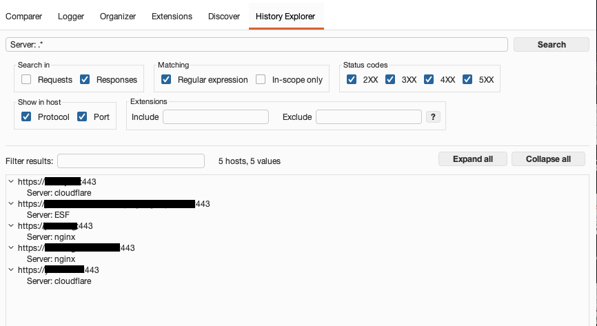
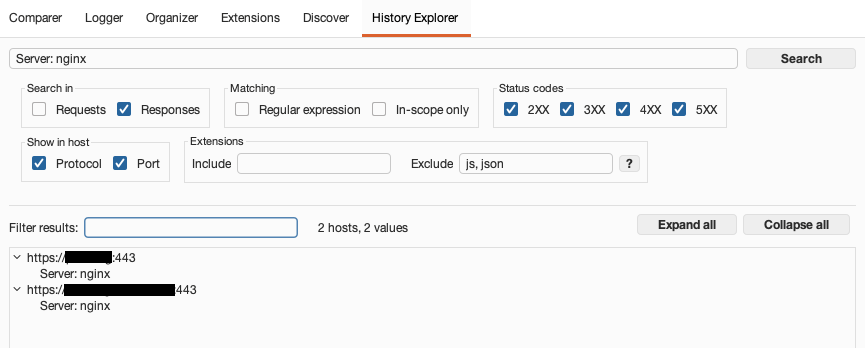

# Burp Suite History Explorer

This extension was developed to assist in filtering search results by host. 
During a large assessment I conducted, I wanted a clear view of which servers were operating on which software. While searching in Burp for the `Server: .*`, it returned the desired information, but I still had to sift through each request.

## Features

- Search using a literal string or a regex by selecting the `Regular expression` checkbox.
- Choose the type of `status code` to include in the history search.
- Include or exclude file extensions in your search. Use the keyword `none` for requests without an extension.
- Results are grouped per host in an expandable tree, one match per row.
- Narrow the results with the `Filter results` box without running the search again.
- Results can be copied with the standard `ctrl + c` combination or the right-click menu. Copied rows are host and value separated by a tab, so they paste straight into a spreadsheet.
- Filter only for in-scope items

## Screenshot

Searching with regex for the Server header.

Literal string search for nginx, and exclusion of requests with no extension, js, php, and css.

## Changelog

- v2.0 (06/08/2026)
  - Results are shown as a per-host tree with one match per row, replacing the `||` joined table cell
  - Result filter box, expand/collapse all, and a right-click copy menu
  - Reworked layout that follows Burp's own theme and fonts
  - Faster searches: message bodies are scanned in parallel and each message is read once instead of twice
  - Fixed literal searches being compiled as regular expressions, so terms such as `?` or `cache[` no longer fail silently
  - Fixed status code, scope and extension filters aborting the rest of the history search

- V1.3 (24/06/2024)
  - Option to stop the search
  - Option to also filter by protocol and port in the "Host" column of the results

- v1.2 (19/02/2024)
  - Improved memory usage
  - Multithreaded execution
  - Option to filter in Requests or Responses only
  - Improved regex parsing

## Development

For bugs and feature ideas open an issue here.  